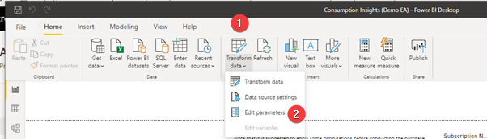
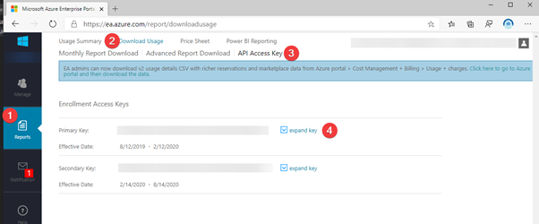
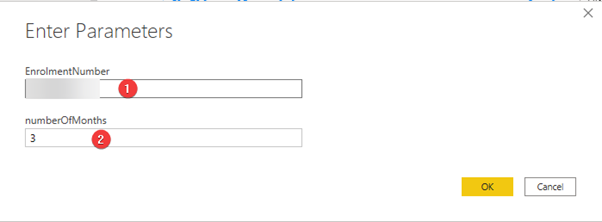

# How to use EA Consumption Insights PowerBI Report to view Azure Usage

### Step 01 - Open Consumption Insights (Demo EA).pbix file using Power BI 
After opening Consumption Insights PowerBI File, click transform data and then select "Edit parameters" 

### Step 02 -  Login to Azure EA Portal 
login to (https://ea.azure.com) portal and click on reports. Click on Download Usage and then select API Access Key.
Click on expand key and you can copy API Access key to retrieve billing data from your Azure EA Enrolment. Make a note of the Enrolment number at the top left corner as we will use this in the next step. 

### Step 03 - Provide Azure EA Enrolment Details
Provide Azure EA Environment Number (from https://ea.azure.com) portal. Provide how many months of data you would like to see in the report (if you provide 12 months, it will take sometime for all the tables to refresh, use as needed)

